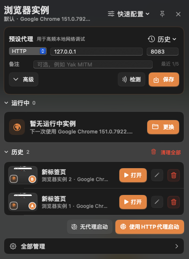
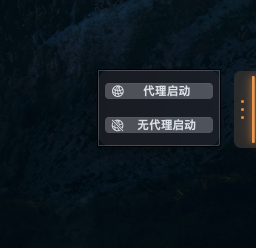
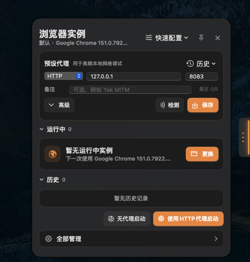

# YTray

<p align="center">
  
</p>

YTray 是一个面向 Chrome 独立实例的开源桌面工作台。它把浏览器版本、独立用户目录、代理、调试端口、本地插件和常用启动参数组合成可重复使用的身份环境，并通过菜单栏托盘与桌面贴边小组件快速管理。

macOS 与 Windows 均为各自平台的原生实现（Swift / AppKit 与 C# / WPF），功能对等。项目不包含授权码、许可证校验、订阅或功能解锁逻辑。

## 它解决什么问题

安全测试、开发联调和日常运营经常需要同时保留多个登录身份：管理员、普通用户、访客、不同租户，或审批流程中的不同参与者。反复退出登录不仅慢，还容易把 Cookie、权限和代理状态混在一起。YTray 为每个实例使用独立的用户目录，让 Cookie、Local Storage、缓存、插件数据和登录态天然隔离，同时仍可复用用户选择的本机 Chrome。

在多身份、多权限测试中，YTray 尤其适合：

- 并排保留管理员、普通用户、匿名用户和不同租户，快速验证 RBAC、越权与数据隔离；
- 用 Dock 角标、名称、页面 Title 和缩略图区分身份，减少在错误账号中执行操作的风险；
- 一键选择直连或预设 HTTP 代理，配合 Yak MITM 等本地调试链路复现问题；
- 为每个实例启用独立调试端口和本地插件，便于接入 Yakit、Yak 引擎或其他 CDP 自动化工具；
- 从历史恢复同一用户目录、角标、插件和上次页面，不需要重新配置测试环境。

YTray 不修改系统浏览器应用的名称、签名、Bundle ID 或钥匙链身份，也不会替换系统默认浏览器。它只负责以隔离参数启动用户明确选择的浏览器进程。

## 产品界面

| 托盘中的实例与历史 | 贴边快捷启动 |
| --- | --- |
|  |  |
| 运行状态、页面缩略图、历史恢复和身份角标集中在紧凑面板中。 | 面板关闭时，鼠标移入橙色贴边标签即可纵向选择启动方式。 |

<p align="center">
  
</p>

<p align="center"><sub>点击贴边标签会展开与菜单栏托盘一致的完整面板；失焦自动隐藏，PIN 后保持显示。</sub></p>

## 安装 macOS 应用

### 方式一：下载 DMG（推荐）

从 [GitHub Releases](https://github.com/yaklang/ytray/releases) 下载最新的 `YTray.dmg`，打开后把 YTray 拖入 Applications 文件夹即完成安装。DMG 由 CI 构建，是 arm64 + x86_64 通用应用，Apple Silicon 与 Intel Mac 均可运行。

应用仅做本机临时签名（没有 Apple 开发者证书），首次打开如被 Gatekeeper 拦截，请在 Finder 中右键点击 YTray.app 并选择“打开”。

### 方式二：本地打包

需要 macOS 14 或更高版本、Xcode Command Line Tools，以及 ImageMagick（提供 `magick` 命令）。进入仓库根目录后运行：

```bash
./script/package-macos.sh
```

脚本会构建 Release 可执行文件、生成应用图标，并组装临时签名的应用包，输出位于 `dist/YTray.app`。把 `YTray.app` 拖入 `/Applications`（或保留在任意目录）双击运行即完成安装，无需开发者账号。追加 `--universal` 可构建双架构应用，`--dmg` 会额外生成 `dist/YTray.dmg`（含 Applications 快捷方式）。图标源文件与打包细节见下文[打包 macOS 应用](#打包-macos-应用)。

## 从源码运行（开发模式）

`./script/startup.sh` 面向开发调试：它编译 Debug 版本并在当前终端前台运行 YTray，**不会安装应用**，关闭终端或按 Ctrl-C 后即退出，适合修改代码后快速验证。

需要 macOS 14 或更高版本以及 Xcode Command Line Tools。进入仓库根目录后运行：

```bash
./script/startup.sh
```

首次编译完成后，菜单栏会出现 YTray 图标。左键菜单栏图标会在图标下方展开并自动聚焦小组件；点击小组件外部时，小组件会立即隐藏，当前点击会继续交给目标应用，不需要再点击第二次。点击标题栏的 PIN 图标可以让小组件在失焦后继续显示，再次点击即可恢复自动隐藏。右键菜单可启动新实例、显示小组件、打开全部管理或退出。

应用启动后还会在主屏幕右缘显示一个橙色贴边小组件。它默认位于屏幕高度的 58%，比 CapTray 的默认位置更靠上，避免两个挂件重叠。完整面板关闭时，鼠标移入会纵向展开“代理启动”和“无代理启动”两个快捷按钮；点击橙色贴边标签会从屏幕边缘展开与菜单栏托盘相同的完整小组件，面板展开期间不再显示悬停按钮。可上下拖动保存位置，右键可以切换左右侧、恢复默认位置或隐藏。隐藏后可从菜单栏图标的右键菜单重新显示。

如果脚本没有执行权限，可先运行：

```bash
chmod +x ./script/startup.sh
```

## 直接使用本机浏览器

YTray 不要求安装额外浏览器运行时。启动时会自动发现标准目录中的 Google Chrome、Chrome Beta、Chrome Canary、Chrome for Testing、Chromium 和 Microsoft Edge；发现后即可用于新实例。

点击小组件右上角“快速配置”，可以：

- 从已发现的本机浏览器中选择下一次启动使用的浏览器；
- 选择其他位置的 `.app` 或浏览器可执行文件，并将其设为下一次选择；
- 自定义本次调试端口、启动地址、Dock 角标和插件；
- 跳转到“浏览器来源”安装一个新的 Chrome for Testing 版本。

选择浏览器只会保存配置，不会立即启动。配置完成后，使用小组件底部的“无代理启动”或“使用HTTP代理启动”创建实例。直接选择浏览器或在自定义向导中勾选“记住此浏览器”后，后续新实例会默认使用该选择。界面会同时显示浏览器类型、完整版本号和来源：

- `系统环境`：自动发现于 `/Applications` 或 `~/Applications`；
- `自定义路径`：用户从其他位置选择的浏览器；
- `YTray 安装`：由镜像下载并管理的 Chrome for Testing。

## 可选：安装 Chrome for Testing

打开“全部管理 → 浏览器来源”，可以重新扫描本机，也可以安装或添加浏览器：

- 安装特定版本：刷新版本列表，选择一个 Chrome for Testing 版本后安装。下载内容是 ZIP，YTray 会校验 SHA-256、解压并直接使用其中的浏览器可执行文件，不运行 PKG、DMG 或任何安装器。
- 选择其他本地浏览器：选择已有的浏览器 `.app`，或直接选择其可执行文件。

托管运行时保存在：

```text
~/Library/Application Support/YTray/Runtimes/
```

## 启动方式

- 无代理启动：使用记住的浏览器创建独立实例，并明确绕过 macOS 系统代理和预设代理。
- 使用HTTP代理启动：使用小组件上方已经保存的“预设代理”创建独立实例。
- 自定义启动：通过步骤向导依次选择运行时、调试参数、Dock 角标、插件并确认。本次设置不会覆盖默认配置；自定义启动使用直连，需要代理时请使用小组件的预设代理入口。角标留空时自动分配，也可以填写 1–2 个英文字母。

每个实例的用户目录位于：

```text
~/Library/Application Support/YTray/Profiles/<实例 UUID>/
```

因此不同实例的 Cookie、缓存、Local Storage、登录态和插件数据不会混在一起。

## 代理、调试与浏览器精简

小组件中“运行中”列表上方的“预设代理”用于高频代理配置：

- 协议、Host 和端口分别填写；当前支持 HTTP 与 HTTPS 代理，默认值为 `http://127.0.0.1:8083`
- 可以填写备注，最近保存的 5 个代理会出现在历史下拉菜单中
- “高级”默认收起；点击后可以填写代理用户名与密码
- “检测”会在 10 秒内并发检查 `example.com`、`baidu.com` 和 `google.com`；只要任意目标通过即判定检测成功，点击结果可查看各目标耗时与错误
- “高级”中可以追加一个特定 URL 或域名；只填写域名时会自动补为 `https://` URL，并与三个默认目标一起检测
- 检测期间小组件会临时固定，失焦不会消失；检测结束后恢复原来的 PIN 设置
- “保存”会将协议、Host、端口、用户名、密码与备注一起保存到最近历史；选择历史代理时会完整回填

代理历史保存在本机 YTray 应用数据的 `state.json` 中，该文件强制使用 `0600` 权限，仅当前 macOS 用户可读写；密码不会进入浏览器命令行，也不会调用 macOS 钥匙链。需要认证时，YTray 会为本次浏览器进程生成一个临时内部扩展响应代理认证。临时文件同样仅当前用户可读写，并在浏览器退出或启动失败后删除。

“全部管理 → 启动设置”可以配置：

- 调试端口的起始值；端口占用时会向后自动选择可用端口
- 启动地址，例如 `chrome://newtab` 或完整的 `https://` URL
- 跳过首次欢迎、关闭默认浏览器检测、后台网络、同步、翻译与通知
- 限制 WebRTC 使用非代理 UDP 和暴露本地 IP
- 忽略证书错误；该选项默认开启，适合本地网络调试
- 自定义附加 Chrome 参数（每行一个）

调试服务始终绑定到 `127.0.0.1`。用户目录、调试地址/端口和插件加载参数由 YTray 维护，附加参数不能覆盖这些隔离边界。

## 本地插件

Chrome 的 `--load-extension` 需要一个已解压插件目录，而不是 `.crx` 安装包。打开“插件管理”，选择根目录包含以下文件的文件夹：

```text
my-extension/
├── manifest.json
├── background.js       # 具体文件取决于插件
└── ...
```

YTray 会读取 `manifest.json` 中的名称、版本和 Manifest 版本。启用的插件可加入默认设置，也可在自定义启动向导中仅为本次实例选择。

当前官方 Google Chrome、Chrome Beta 和 Chrome Canary 会忽略命令行加载未打包扩展的能力；因此本地插件和需要用户名/密码的代理认证应选择 Chrome for Testing、Chromium 或 Edge。普通无认证 HTTP 代理、实例隔离和 CDP 调试仍可直接使用系统 Google Chrome。YTray 会在不兼容的浏览器上给出明确提示，不会静默启动一个缺少插件或代理认证的实例。

## 运行与历史

托盘和“全部管理 → 运行与历史”会分别显示全部运行中的浏览器和已经停止的历史记录。运行中的浏览器会显示 PID、浏览器版本、独立用户目录、启动模式和调试端口，并支持：

- 使用 A、B、C、D 依次区分每个浏览器进程的 Dock 图标
- 在自定义启动向导中把本次角标设置为任意 1–2 个英文字母
- 停止实例
- 在 Finder 中打开用户目录
- 通过 Chrome DevTools Protocol 对当前页面快速截图

YTray 会在运行期间记录当前活动标签页的 Title 和 URL，并在浏览器停止时保留为历史标题。同一 Dock 角标只保留最新一条历史，避免出现多个 A、B 等重复记录。历史名称可以修改，历史记录可以单独删除，也可以通过“清理全部”在二次确认后一次清空；这些操作不会终止正在运行的浏览器。

历史记录右侧的“打开”会恢复同一实例，而不是创建一个新编号：它会继承原实例名称、UUID、A/B/C Dock 角标、独立用户目录、启动参数与插件，并恢复上次活动标签页。若原角标正在被另一个运行中实例占用，会提示用户先释放该角标。升级前已经保存且没有活动页 URL 的旧历史，只能由浏览器尽力恢复上次会话。

Dock 角标只设置在本次启动的进程上。YTray 先让启动进程显示带角标的浏览器图标，再由同一个 PID 直接执行用户选择的原始浏览器可执行文件。它不会复制浏览器 `.app`，不会修改应用名称、Bundle ID、`Info.plist`、磁盘图标或签名，也不会替换浏览器的钥匙链身份。浏览器启动后仍然是原来的 Chrome、Edge 或 Chromium。

运行中的角标必须唯一，默认从 `A` 排到 `Z`，随后使用 `AA` 到 `ZZ`。macOS 的公开接口不能在 `exec` 完成后从另一个进程即时替换该 Dock tile 的图标，因此自定义角标需要在启动前填写；要更换运行中实例的角标，请停止后用新角标重新启动。

截图保存在：

```text
~/Pictures/YTray/
```

YTray 运行期间会约每 12 秒自动更新一次活动标签页截图。缩略图会显示在运行卡片中，并在实例退出后继续保留于历史；鼠标悬停可查看较大的预览，从而快速辨认实例用途。

点击运行卡片中的截图按钮还可以立即保存一张完整截图。手动截图完成后会在 Finder 中定位文件。

## 开发验证

```bash
swift build --package-path darwin
swift test --package-path darwin
```

如需同时运行真实 Chrome for Testing 的代理认证集成测试，可指定其可执行文件：

```bash
YTRAY_CFT_PATH="/path/to/Google Chrome for Testing" swift test --package-path darwin
```

该测试会在本机启动临时 HTTP 代理和浏览器实例，验证 `407` 认证、临时扩展注入以及最终页面加载；测试结束后会清理临时进程和文件。

项目结构按平台分开：

```text
darwin/     # Swift / AppKit / SwiftUI 原生实现
windows/    # Windows 原生（C# / WPF）实现
script/     # 本地启动脚本
```

## 打包 macOS 应用

应用图标的可编辑矢量源位于 `darwin/Resources/YTrayAppIcon.svg`。运行以下命令会构建 Release 可执行文件、生成完整的 macOS `.iconset` 和 `.icns`，并创建临时签名的应用包：

```bash
./script/package-macos.sh
```

输出位于 `dist/YTray.app`。打包需要 Xcode Command Line Tools 和 ImageMagick 的 `magick` 命令。

两个可选参数：

- `--universal`：构建 arm64 + x86_64 双架构应用（会校验产物确实包含两种架构）；
- `--dmg`：额外生成 `dist/YTray.dmg`，内含 YTray.app 与 `/Applications` 快捷方式，并输出 SHA-256。

CI 会在 push `v*` tag 时自动执行 `./script/package-macos.sh --universal --dmg`，把 `YTray.dmg` 与 Windows 的 `YTray.exe` 一并附到对应的 GitHub Release。
