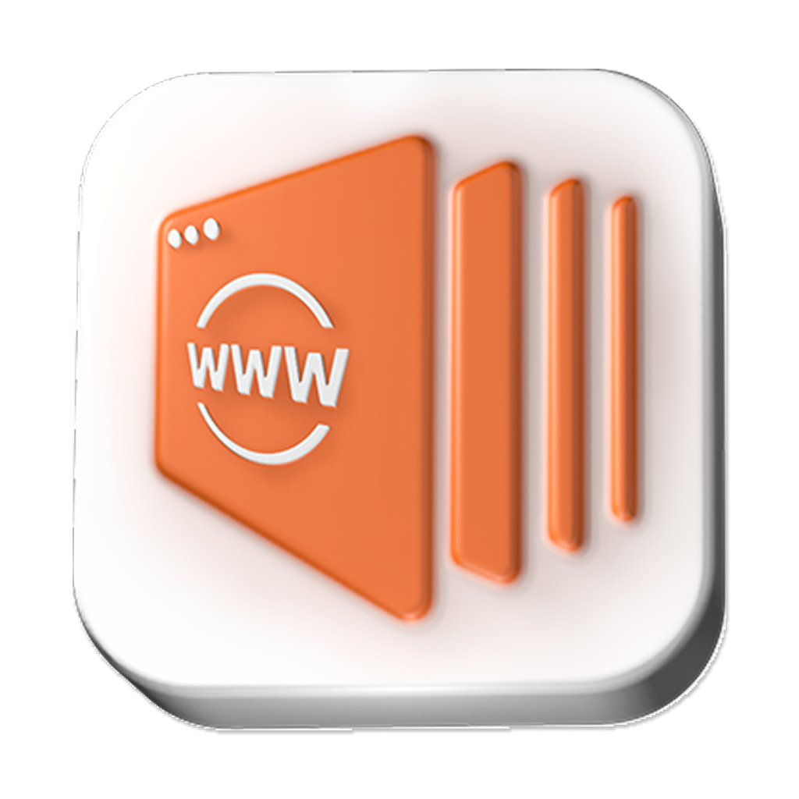
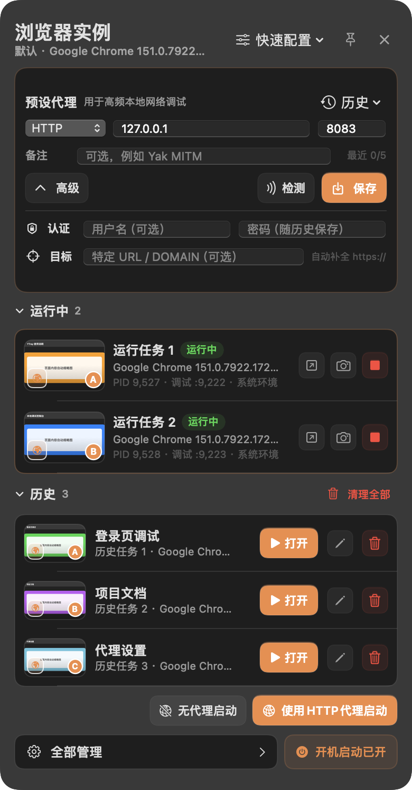

# YTray

<p align="center">
  <br>
  <strong>多身份浏览器实例工作台</strong><br>
  把独立用户目录、HTTP 代理、调试端口、本地插件和历史恢复，放进一个原生桌面应用。
</p>

<p align="center">
  <a href="https://github.com/yaklang/ytray/actions/workflows/darwin.yml"></a>
  <a href="https://github.com/yaklang/ytray/actions/workflows/windows.yml"></a>
  <a href="https://github.com/yaklang/ytray/actions/workflows/pages.yml"></a>
</p>

<p align="center">
  <a href="https://yaklang.io/ytray/">官方网站</a> ·
  <a href="https://github.com/yaklang/ytray/releases/latest">下载最新版</a> ·
  <a href="https://aliyun-oss.yaklang.com/ytray/latest.json">发布清单</a>
</p>


YTray 面向安全测试、开发联调和多账号运营：管理员、普通用户、访客或不同租户可以同时保持登录，不需要反复退出，也不会把 Cookie、缓存和插件状态混在一起。

macOS 版本使用 Swift、AppKit 与 SwiftUI；Windows 版本使用 C# 与 WPF。两端都直接使用平台原生窗口、托盘和开机启动机制。

## 设计重点

- 每个实例使用独立用户目录，隔离 Cookie、Local Storage、缓存、插件数据与登录态。
- 显式区分“无代理启动”和“使用 HTTP 代理启动”，避免网络路径含糊。
- 调试服务只绑定 `127.0.0.1`，端口占用时自动向后选择。
- 运行实例提供页面缩略图、PID、浏览器版本、调试端口、停止和截图入口。
- 历史记录可以恢复同一个身份环境、用户目录、插件、角标与最近页面。
- 支持本机 Chrome、Chrome Beta、Chrome Canary、Chrome for Testing、Chromium 与 Edge。
- 安装包构建时下载并校验最新 Yakit Browser Agent，再作为默认本地插件内置。
- YTray 会在后台检查正式版本；发现更新后可在应用内查看进度、校验并安装，不需要重新打开网站手动下载。

YTray 不修改系统浏览器的名称、Bundle ID、签名或默认浏览器设置。它只用隔离参数启动用户明确选择的浏览器。

## 开机启动是一级功能


安装版第一次启动时，YTray 会尝试默认开启开机启动，并把结果明确告诉用户：

- macOS 使用系统 Login Items；
- Windows 使用当前用户的启动项注册表；
- 登录系统时只启动 YTray 并进入菜单栏或系统托盘，不会自动打开浏览器；
- 自动开启失败不会阻断其他功能，侧栏页面和小组件都可以重试；
- 关闭前必须二次确认，避免误触。

从源码直接运行属于开发构建，不会修改 macOS Login Items。这个边界可以避免本地调试意外污染系统启动项。

## 主操作台

<p align="center">
  
</p>

小组件把高频动作放在一起：

- 编辑、保存和检测 HTTP/HTTPS 代理；
- 无代理或使用预设代理启动实例；
- 查看运行状态和最近页面缩略图；
- 聚焦、截图或停止浏览器；
- 恢复、重命名或删除历史；
- 直接查看与控制开机启动状态。

桌面贴边入口提供同一个面板，也可以只展开直连与代理两个启动按钮。面板默认失焦隐藏，PIN 后保持显示。

## 下载与平台支持

最新版本由 [GitHub Releases](https://github.com/yaklang/ytray/releases/latest) 和 [Yaklang OSS](https://aliyun-oss.yaklang.com/ytray/releases.json) 同步提供。

| 平台 | 架构 | 安装包 |
| --- | --- | --- |
| macOS 14+ | Apple Silicon / arm64 | `YTray-<version>-darwin-arm64.dmg` |
| macOS 14+ | Intel / amd64 | `YTray-<version>-darwin-amd64.dmg` |
| Windows 10/11 | x64 / amd64 | `YTray-<version>-windows-amd64-setup.exe` |
| Windows 10/11 | x86 / 386 | `YTray-<version>-windows-386-setup.exe` |

Windows on ARM 当前可以通过系统兼容层运行 x64 版；项目暂未发布原生 Windows ARM64 安装包。

安装版会通过 OSS `latest.json` 自动检查 YTray 自身更新。Windows 下载对应架构的官方 Setup，校验大小和 SHA-256 后静默安装并重新启动；macOS 下载对应架构的官方 DMG，校验大小、SHA-256、Bundle ID、版本与开发者签名后替换当前 `.app`，失败时恢复旧版本。写入 `/Applications` 时仍会显示 macOS 的系统管理员授权窗口。

Release CI 支持 Developer ID hardened runtime 签名，并在 Apple 账号凭据齐全时分别公证、装订 `.app` 与 DMG；Windows 也支持与 CapTray 相同的 Azure 代码签名凭据。若仓库没有配置相应 secrets，流程会明确降级为临时签名或未签名安装包。此时若 Gatekeeper 阻止首次打开，请在 Finder 中右键 YTray，选择“打开”，并确认只从本仓库 Release 或上述 OSS 路径下载。

## 使用流程

1. 打开“浏览器运行时”，选择系统浏览器、其他本地浏览器，或安装 Chrome for Testing。
2. 在“快速配置”中选择直连、预设 HTTP 代理，或进入自定义启动向导。
3. YTray 为新实例分配独立用户目录和本地调试端口，并加载选择的插件。
4. 在小组件或“运行与历史”中管理实例；停止后可从历史恢复同一个身份。


### 数据位置

macOS：

```text
~/Library/Application Support/YTray/
├── Profiles/       # 独立浏览器用户目录
├── Plugins/        # 本地与内置插件
├── Runtimes/       # 可选 Chrome for Testing
├── Screenshots/    # 用户导出的页面截图
├── Logs/           # YTray 运行日志、错误日志与浏览器实例日志
└── state.json      # 配置和历史
```

Windows 使用当前用户的 Local Application Data 下的 YTray 目录，保持相同的数据分区语义。

### 插件与浏览器限制

Chrome 的命令行本地插件参数需要已解压插件目录。官方 Google Chrome 稳定版、Beta 和 Canary 可能忽略命令行加载未打包扩展，因此需要本地插件或代理用户名/密码认证时，推荐 Chrome for Testing、Chromium 或 Edge。普通无认证 HTTP 代理、独立用户目录和 CDP 调试仍可使用系统 Chrome。

## 本地开发

### macOS

要求 macOS 14+ 和 Xcode Command Line Tools：

```bash
./script/startup.sh
```

该脚本以前台 Debug 模式运行，按 `Ctrl-C` 结束。完整测试：

```bash
swift test --package-path darwin
```

构建带最新版插件的本机架构 DMG：

```bash
./script/package-macos.sh --dmg
```

也可以显式指定 `--arch arm64`、`--arch amd64` 或 `--arch universal`。

### Windows

要求 Visual Studio 2022 Build Tools、.NET Framework 4.8.1 Developer Pack、PowerShell 7；生成安装包还需要 Inno Setup 6：

```powershell
./windows/build.ps1 -Release -Test -Package -Installer -Architecture amd64
```

将 `-Architecture` 改为 `386` 可构建 32 位版本。`-Package` 会先从官方 OSS 清单解析并下载最新 Yakit Browser Agent，校验 SHA-256、大小和 ZIP 路径安全后才开始编译。

### 官方网站

官网位于 `site/`，使用 Next.js、React、Tailwind CSS v4 与 shadcn/ui，构建时静态导出到 `site/out/`：

```bash
cd site
npm install
mkdir -p public/assets
cp ../docs/images/v0.1.0/*.png public/assets/
npm run dev
```

生产构建使用 `/ytray` 作为 GitHub Pages 基础路径：

```bash
YTRAY_BASE_PATH=/ytray NEXT_PUBLIC_BASE_PATH=/ytray npm run build
```

React Bits Pro 授权只保存在本机的 `site/.env.local`；其授权信息、Skill 与设计配方均已被 Git 忽略，不能提交到仓库。

### 应用图标与核心美术资源

生产应用图标的唯一源文件是 [`assets/app-icon/YTray.png`](assets/app-icon/YTray.png)。它会派生出 macOS `.icns`、Windows 多尺寸 PNG/ICO、系统托盘资源，以及官网 favicon、Apple Touch Icon 和 PWA 图标。更换源文件后统一执行：

```bash
./script/generate-app-icons.sh
```

生成脚本最后会运行 `script/verify-app-icons.py`，验证各尺寸、ICO 帧、官网展示图与源码引用；CI 和正式发版也会再次执行同一校验。

## CI、Pages 与发版

- `macOS`：Swift Release 构建、测试、真实 UI 渲染、最新版插件打包、通用 DMG 挂载验证。
- `Windows`：WPF 构建、测试、独立 EXE 冒烟、真实设计截图和 Inno Setup 安装包。
- `Pages`：安装锁定依赖、装配版本化真实截图、静态导出 Next.js 官网，发布后用 `deploy-meta.json` 验证线上 commit。
- `Release`：仅由 `v*` tag 触发；分别构建 macOS arm64/amd64 与 Windows amd64/386，确认四个安装包使用同一最新插件版本，再发布到 GitHub 与 OSS。

OSS 版本产物使用不可变路径：

```text
https://aliyun-oss.yaklang.com/ytray/<version>/<filename>
```

发布流程先上传并公开校验所有版本化文件，再更新 `latest.json`、`latest.txt` 与 `releases.json`。若相同版本路径已经存在不同内容，CI 会拒绝覆盖。每个安装包同时提供 SHA-256 文件，完整信息记录在版本 `manifest.json` 中。
桌面端更新器只读取这个最终发布的 `latest.json`，并严格选择当前平台与进程架构的安装包；未通过大小、SHA-256 或平台签名检查的文件不会执行。

## 项目结构

```text
darwin/                 Swift / AppKit / SwiftUI 应用与测试
windows/                C# / WPF 应用、测试与 Inno Setup
script/                 macOS 打包、插件准备和发布索引
site/                   Next.js / React / shadcn 官方网站（静态导出）
assets/app-icon/        跨平台应用图标的 1024px 核心美术源文件
docs/images/v0.1.0/     由应用真实渲染的版本化截图
.github/workflows/      macOS、Windows、Pages 与 Release 流程
```

## 安全与隐私边界

- YTray 不上传浏览器配置、Cookie、历史或代理凭据。
- macOS 状态文件限制为当前用户读写；代理认证临时扩展在浏览器退出或启动失败后清理。
- Windows 开机启动只写当前用户范围，不修改系统级启动服务。
- 浏览器调试端口只监听回环地址。
- 下载的 Chrome for Testing 和内置插件在使用前校验清单与 SHA-256。

源码公开于本仓库。仓库当前未包含单独的 LICENSE 文件；复用或分发前请先确认适用授权。
