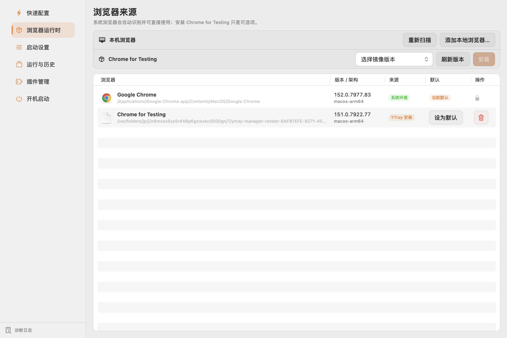
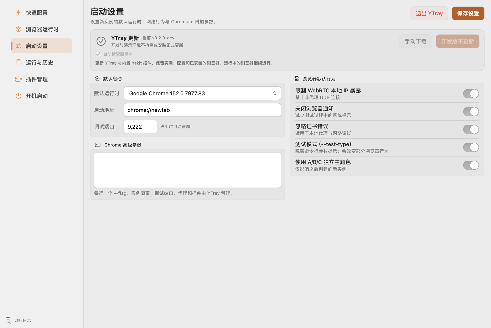
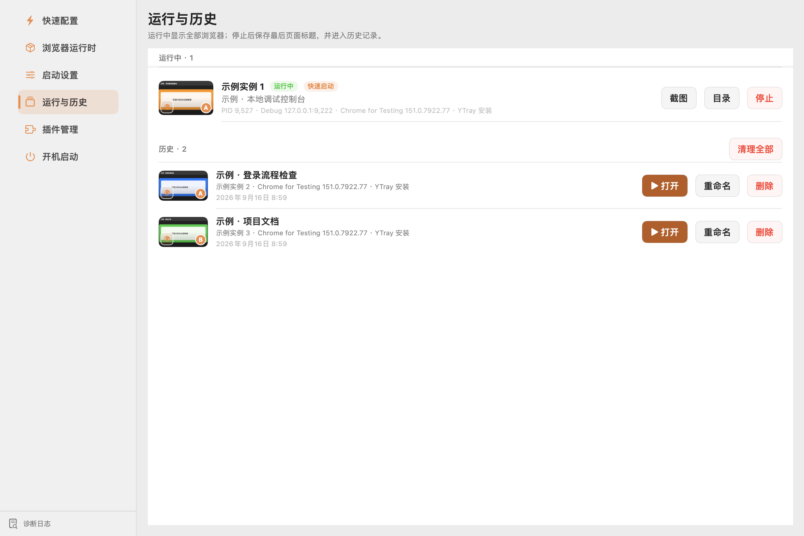
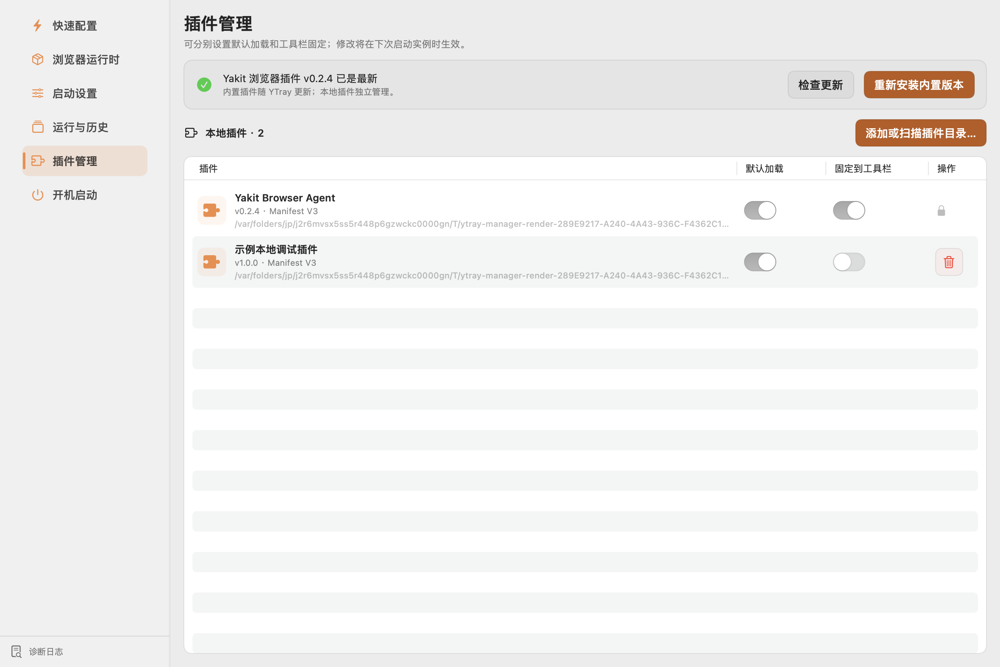
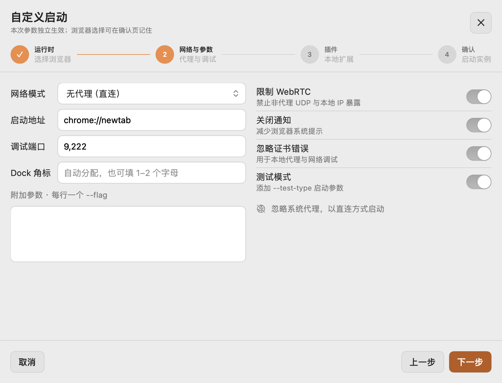
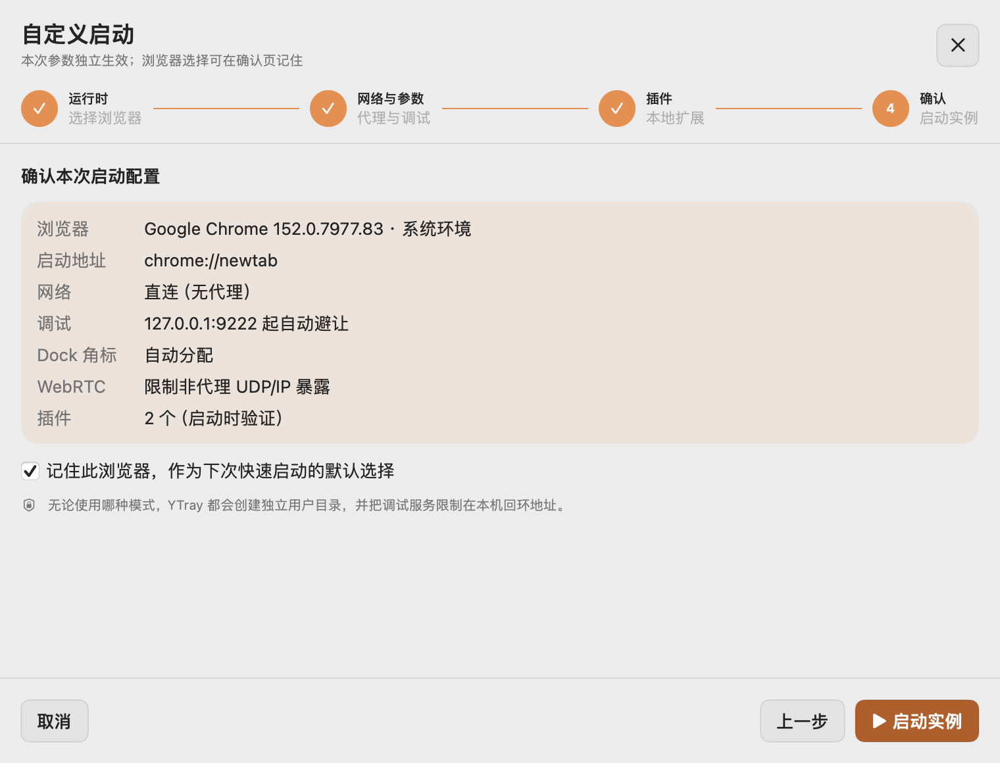

# macOS 控制台布局评审

本次调整参考 YConnect `e42005a` 的完整侧栏、原生分组和统一操作样式。覆盖 YTray 六个控制页及自定义启动向导。

## 布局规则

| 项目 | 调整后 |
| --- | --- |
| 导航 | 打开管理窗口时展开；最小宽度 200 点，建议宽度 208 点，六个名称完整显示 |
| 页面留白 | 外边距 24 → 16 点；主要分组间距 18 → 12 点 |
| 操作控件 | 按钮、菜单下拉框、单行输入框统一 32 点高度；文字按钮 13 点字号；图标按钮 32 × 32 点 |
| 开关 | 表单说明左对齐、开关置于行末；表格内开关与对应列靠左对齐 |
| 退出 | 启动设置右上角提供“退出 YTray”，复用应用的正常退出路径；支持 ⌘Q |
| 小窗口 | 表单可纵向滚动，浏览器和插件表格保留默认项与操作列 |

## 截图说明

以下 PNG 直接来自本次 Release 配置编译的 `YTrayDev 0.2.0-dev` 原生 SwiftUI 视图。浏览器、插件与历史使用隔离的示例数据，不读取或改变生产配置；开发预览按既有规则禁用正式更新。截图未做视觉重绘。默认窗口请求尺寸为 1180 × 760 点，最小窗口请求尺寸为 880 × 600 点；系统导航工具栏可能使渲染内容增加 28 点高度。

## 六个控制页

### 快速配置

卡片收紧为 130 点最小高度，标题与图标同排，统一启动按钮。


### 浏览器来源

镜像下拉框与刷新、安装按钮同为 32 点；缩小窗口时默认和操作列仍可见。



### 启动设置

默认启动与高级参数归为一列，行为开关靠右，加入退出 YTray。



### 运行与历史

截图、目录、停止、打开、重命名和删除使用同一套标准按钮。



### 插件管理

更新和安装按钮统一高度，开关与列标题靠左对齐，完整显示操作列。



### 开机启动

缩小状态区域和说明留白，开关置于状态行右侧。


## 自定义启动向导

### 1. 选择运行时


### 2. 网络与参数



### 3. 选择插件


### 4. 确认启动



## 最小窗口与深色模式

| 页面 | 最小窗口 | 深色模式 |
| --- | --- | --- |
| 快速配置 | [截图](images/macos-console/ytray-console-compact-quick.png) | — |
| 浏览器来源 | [截图](images/macos-console/ytray-console-compact-runtimes.png) | [截图](images/macos-console/ytray-console-dark-runtimes.png) |
| 启动设置 | [截图](images/macos-console/ytray-console-compact-settings.png) | [截图](images/macos-console/ytray-console-dark-settings.png) |
| 运行与历史 | [截图](images/macos-console/ytray-console-compact-instances.png) | — |
| 插件管理 | [截图](images/macos-console/ytray-console-compact-plugins.png) | — |
| 开机启动 | [截图](images/macos-console/ytray-console-compact-launchAtLogin.png) | — |

[网络与参数 · 深色模式](images/macos-console/ytray-console-wizard-dark-1.png)

## 复现与验证

```sh
swift test --package-path darwin
./script/package-macos.sh --arch arm64 --dev
bash script/render-macos-console.sh /tmp/ytray-console-review \
  "$PWD/dist/darwin-arm64-dev/YTrayDev.app/Contents/MacOS/YTrayDev"
actionlint .github/workflows/darwin.yml
```

本机测试：93 个测试中 85 个通过，8 个显式启用的真实浏览器集成用例跳过，零失败。Release 编译、开发包签名校验、全部 19 张界面渲染、Shell 语法、工作流语法和 diff 空白检查通过。原生自动点击服务当前不可用，验证依据为上述测试与逐页原生渲染复查。

macOS CI 同样生成六页正常/最小窗口、深色设置/浏览器页、向导四步及深色网络页，共 19 张控制台截图，并保留原有小组件、打包与原生更新引擎检查。Windows 双架构 CI 按仓库既有流程运行。
