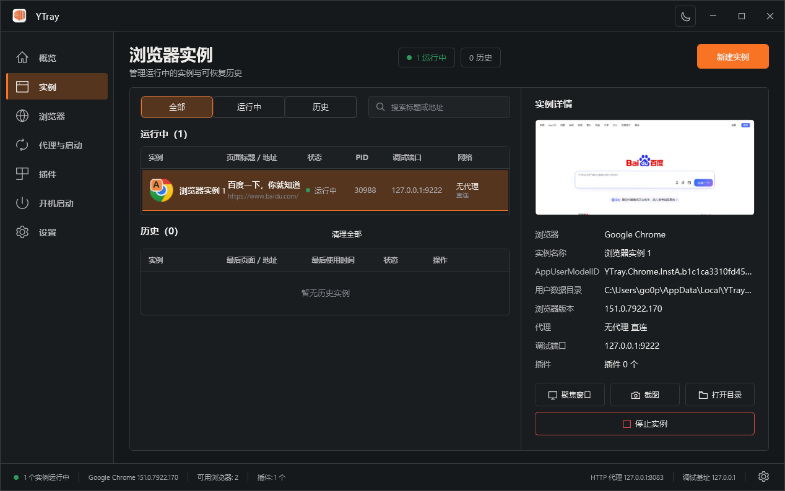
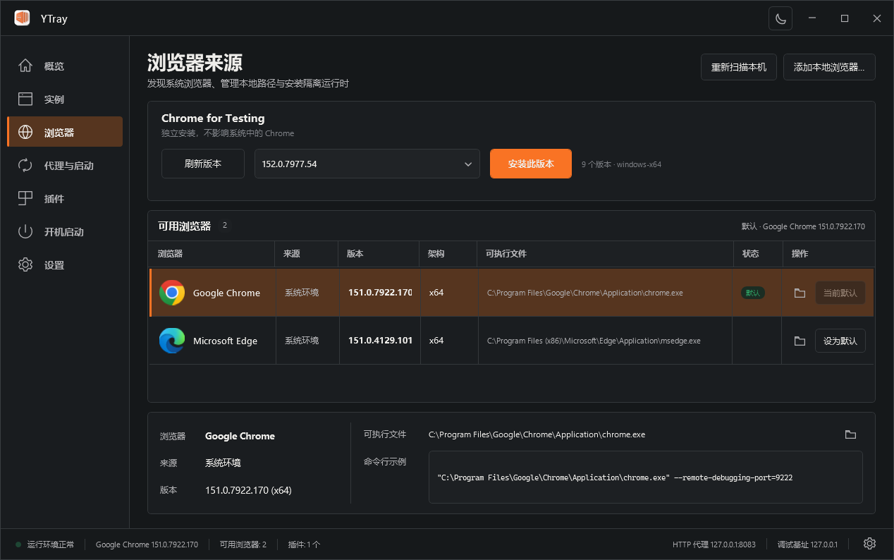
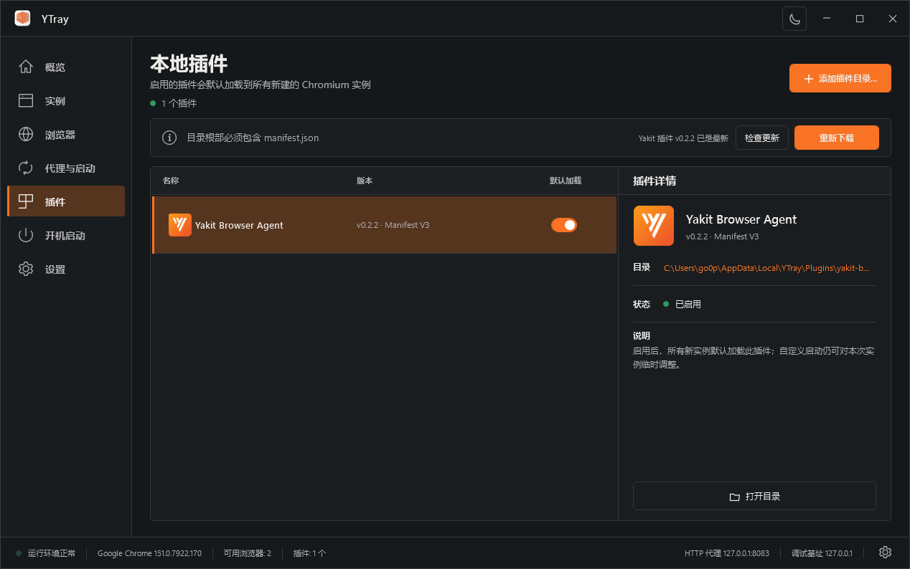
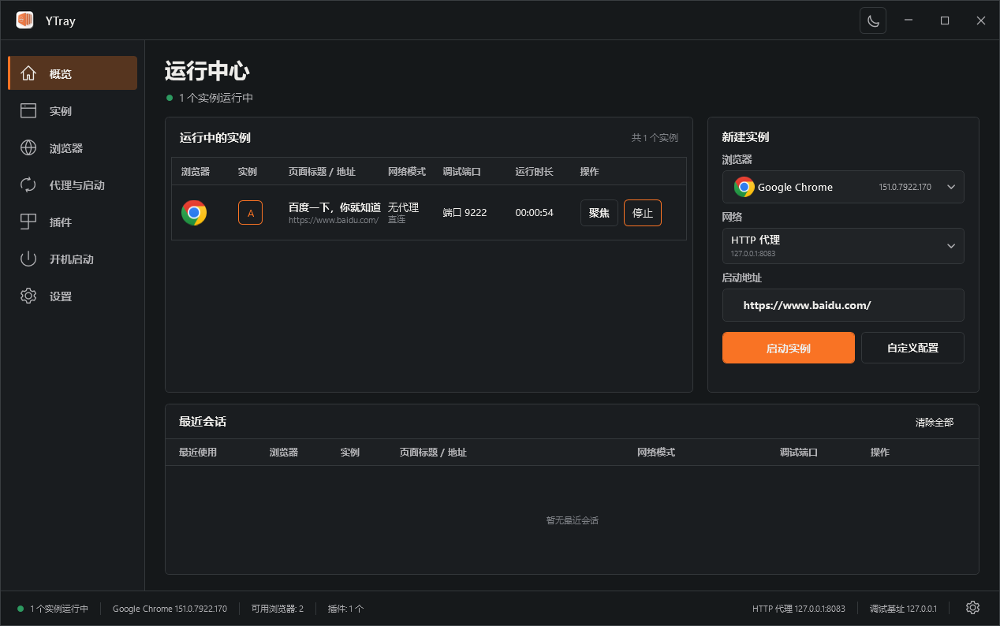
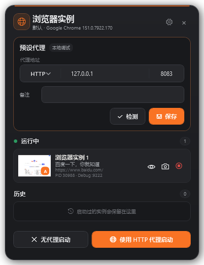

# YTray：把浏览器账号、代理和插件，装进独立实例

做多角色权限测试时，你可能同时需要管理员、普通用户和访客账号；做研发联调时，又要频繁切换代理、浏览器版本和本地插件。

反复退出登录、开无痕窗口、手动维护多个 Chrome Profile，不仅麻烦，也很容易混淆测试环境。

YTray 是一款面向安全测试与研发联调的原生桌面应用。它可以为每项任务创建独立、可恢复的本地浏览器实例，把账号、代理、插件、浏览器版本和调试端口放在一起管理。



## 一个实例，一套独立浏览器环境

每个 YTray 实例都有独立的用户目录，Cookie、Local Storage、缓存、插件数据和登录状态互不影响。

例如，可以同时保留：

```text
A：管理员账号 + 直连网络
B：普通用户账号 + HTTP 代理
C：访客账号 + 指定版本 Chrome for Testing
```

macOS Dock 和 Windows 任务栏会使用 A、B、C 角标区分实例，不用再逐个切换窗口确认身份。

## YTray 能做什么？

**身份隔离**

不同账号可以同时登录同一系统，适合多角色权限测试、多租户联调和长期任务。

**浏览器与网络配置**

YTray 会自动识别本机 Chrome、Edge 和 Chromium，也可以安装指定版本的 Chrome for Testing。启动时可以明确选择直连或 HTTP 代理，避免网络路径含糊。

**本地插件与调试**

启用本地插件后，新实例会自动加载。正式安装包还内置了 Yakit Browser Agent。每个实例会分配独立调试端口，并且只绑定 `127.0.0.1`。

**运行管理与历史恢复**

YTray 会记录页面标题、地址、缩略图、PID 和调试端口。实例停止后，用户目录和登录状态仍会保留，之后可以从历史中继续恢复。

## 四步开始使用

### 第一步：选择浏览器

进入“浏览器”页面，选择系统浏览器，或者安装 Chrome for Testing。



如果需要加载本地插件、使用代理认证或固定浏览器版本，推荐使用 Chrome for Testing、Chromium 或 Edge。

### 第二步：启用插件

进入“插件”页面，可以加载根目录包含 `manifest.json` 的本地插件，也可以直接使用内置的 Yakit Browser Agent。



打开“默认加载”后，后续创建的新实例会自动携带该插件，不需要每次重复选择。

### 第三步：选择网络并启动

回到概览页，选择浏览器、网络模式和启动地址，然后点击“启动实例”。



高频操作可以直接选择“无代理启动”或“使用 HTTP 代理启动”；需要临时调整插件、端口和 Chrome 参数时，再进入自定义启动。

代理地址可以预先保存和检测，用户名与密码不会直接写入浏览器命令行。

### 第四步：管理和恢复实例

实例启动后，可以在主窗口或贴边悬浮面板中：

- 查看页面缩略图和运行状态；
- 聚焦浏览器窗口；
- 截图；
- 打开实例目录；
- 停止实例；
- 从历史中恢复原来的身份环境。



平时可以让 YTray 驻留在 macOS 菜单栏或 Windows 系统托盘中，需要时再打开完整管理界面。

## 一个典型场景

测试后台系统的权限控制时，可以分别创建管理员、普通成员和只读访客三个实例，让它们同时访问同一页面。

这样可以直接对比不同角色看到的按钮、数据和接口行为；即使中途关闭浏览器，下次也能恢复原来的账号和测试环境。

需要走代理的实例单独选择 HTTP 代理，不会影响其他直连实例。

## 数据留在本机

YTray 不会上传 Cookie、浏览器历史、登录状态、代理凭据或本地插件数据。

它只会在需要时访问正式版本清单，以及用户主动下载的浏览器、插件和安装包资源。调试服务只监听本机回环地址。

YTray 也不会修改系统浏览器的名称、签名或默认浏览器设置，它只使用隔离参数启动用户明确选择的浏览器。

## 下载 YTray

YTray 目前支持：

- macOS 14 及以上，Apple Silicon 和 Intel；
- Windows 10 / 11，x64 和 x86。

官方网站会根据当前设备推荐对应安装包：

```text
https://yaklang.io/ytray/
```

也可以从 GitHub Releases 下载最新版：

```text
https://github.com/yaklang/ytray/releases/latest
```

安装之后，YTray 可以在应用内检查、下载、校验并安装后续更新，不需要每次重新打开网站寻找安装包。

如果你正在进行多角色权限测试、研发联调、浏览器插件调试或多账号环境管理，可以用 YTray 把零散的浏览器配置整理成清晰、可恢复的任务实例。

源码仓库：

```text
https://github.com/yaklang/ytray
```

请仅在合法、授权的开发与安全测试场景中使用。
