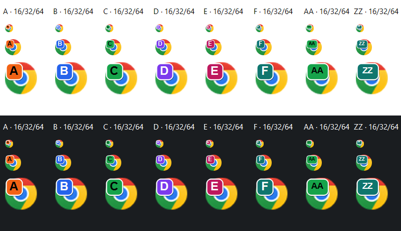
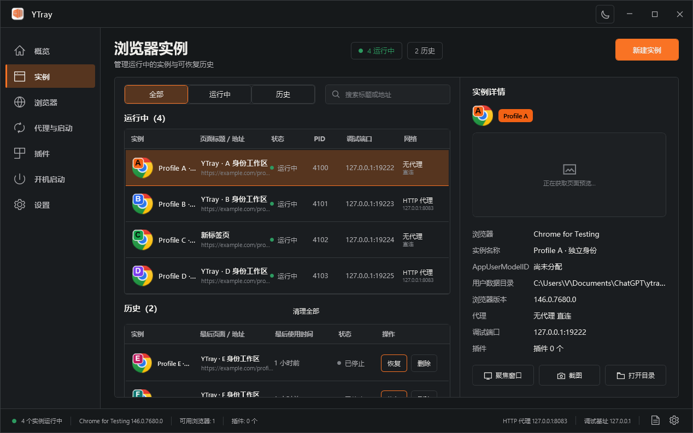
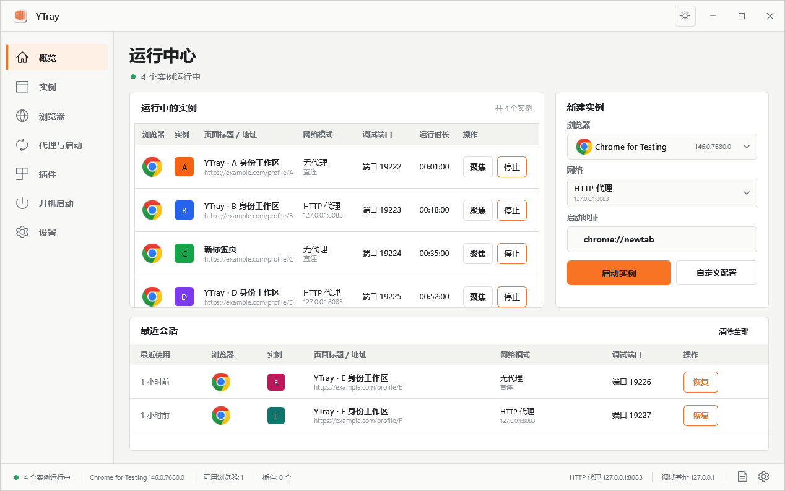
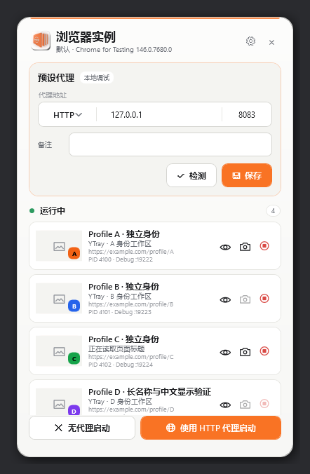
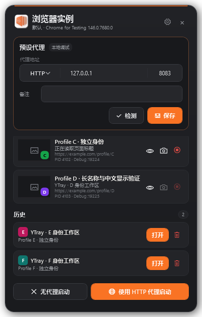

# Windows 实例配色与外观验证

基于 macOS `fadc155`（v0.1.16）的身份色行为，仅修改 Windows。A 橙、B 蓝、C 绿、D 紫、E 品红、F 青绿，之后按字母序号循环。Windows 保留左上角任务栏标识，为 Chrome for Testing 的右下角标记留出位置。

新 Profile 默认安装对应的 Chromium 主题。设置开关支持关闭自动配色；历史恢复不重装主题，保留 Profile 内的用户选择。小组件、概览、实例列表和详情使用相同颜色，正式 Logo 覆盖主窗口、小组件及启动向导。

本次真实渲染发现并修复了小组件在浅色切换到深色后，操作图标、输入框边框和样式继续持有旧画刷的问题。运行中、加载中、停止中、历史记录和错误提示均在两种主题中检查。

| 浅色小组件 | 深色小组件与历史 |
| --- | --- |
|  |  |

## 本地验证

- Debug x64、Release x64、Release x86 构建通过。
- MSTest：80 通过，1 个已有的联网诊断测试默认跳过；无失败。
- WPF 回归测试复用同一个已打开的小组件，在深色、浅色、深色、系统主题间切换，验证操作图标、输入框、身份色和设置保存。
- 702 个合法角标的颜色循环及文字对比度验证；A–F、AA、ZZ 的 16/20/24/32/40/48/64/256px 渲染验证。
- 使用本机 Chrome 152.0.7977.83 创建 A/B/C/D，验证 CDP 页面、实际窗口 AUMID、Shell 图标资源及落盘的 `autogenerated.theme.color`。在隔离的测试 Profile 中更改主题后，通过 YTray 恢复，确认颜色未被重新覆盖。
- 最终独立 EXE 验证通过，包含 Yakit Browser Agent 0.2.4；无需相邻第三方 DLL。
- 最终独立 EXE 输出 46 张页面/交互截图及 1 张联系表：7 个管理页面、详情、主题/网络/版本下拉、4 步向导、小组件明暗/历史/空状态/贴边、缩略图浮窗和系统托盘菜单。系统托盘菜单采用 Windows 原生菜单外观。

复现命令见 [Windows README](../README.md#实例主题与外观验证)。完整截图随现有 Windows CI artifact 输出；真机验证按 README 的 `--smoke-identities` 命令在装有 Chrome 的 Windows 电脑运行。此命令使用指定输出目录内的隔离测试 Profile，并关闭自己创建的浏览器。
