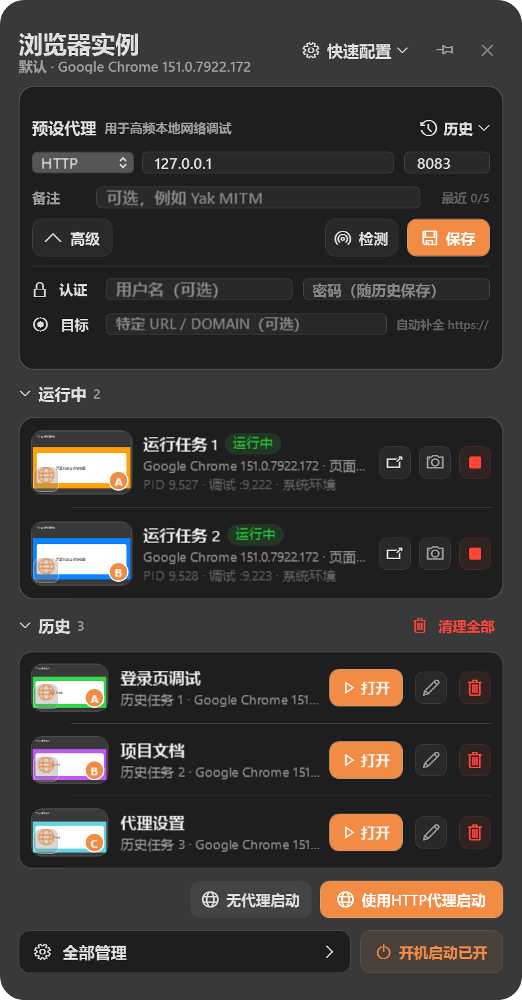

# Windows 小组件与 macOS 对照

Windows 小组件按仓库 `docs/images/v0.1.0/ytray-widget.png` 和 `darwin/Sources/YTray/Views.swift` 的尺寸重建。下面是本机 Windows WPF 控件的真实渲染，使用与参考图相同的两条运行实例、三条历史记录和展开代理配置。数据与缩略图是隔离的演示数据，未读取个人浏览记录。



| 项目 | 逻辑尺寸（DIP） | 2 倍截图 |
| --- | ---: | ---: |
| 面板 | 390 × 746 | 780 × 1492 |
| 代理卡片（展开 / 收起） | 212 / 136 高 | 424 / 272 高 |
| 输入框与协议下拉框 | 16 高 | 32 高 |
| 常规 / 主要按钮 | 28 高 | 56 高 |
| 实例图标按钮 | 24 × 24 | 48 × 48 |
| 运行实例行 | 68 高 | 136 高 |
| 历史实例行 | 54 高 | 108 高 |
| 底部管理 / 开机启动 | 32 高 | 64 高 |
| 水平内边距 / 分区间距 | 14 / 9 | 28 / 18 |

小组件使用中性灰面板、深色卡片和 macOS 源码的 `#F28B44` 橙色，控件不继承管理窗口的全尺寸模板。输入框的内边距只计算一次，按钮标签经过实际布局检查。Windows 使用系统字体和 Segoe 图标，字形与抗锯齿由 WPF 渲染。

新增的高级配置、代理历史、运行/历史折叠、固定、历史改名/清理和开机启动按钮均连接到实际功能。实例维护刷新不会覆盖正在编辑的代理草稿；空间不足时只有实例区域滚动，启动和底部操作始终可见。浅色主题和运行时主题切换继续可用。

| 收起高级配置 | 浅色展开态 |
| --- | --- |
|  |  |

## 复现

```powershell
./windows/build.ps1 -Release -Test
./windows/src/bin/Release/YTray.exe --capture-widget-review C:\Temp\ytray-widget-review
# 打开可交互的隔离预览：
./windows/src/bin/Release/YTray.exe --preview-widget C:\Temp\ytray-widget-preview
```

截图模式输出四张 PNG、`metrics.json` 和完成标记；固定以 192 DPI 渲染，直接得到 780 像素宽的图片。所有状态写在指定目录的 `fixture-state` 中，不启动浏览器、不注册开机启动。现有 `--capture-design-review` 也会生成这些图，因此 Windows CI 的截图 artifact 包含同一组对照。

本地验证：Release x64 构建、104 项 MSTest（103 通过、1 项原有联网诊断跳过）；其中 WPF 检查覆盖尺寸、下拉框铺满、按钮文字不裁切、认证与目标保存、历史回填、草稿保留、主题切换、短屏滚动和空状态。另已通过实际窗口操作核对协议选择和高级配置折叠。
